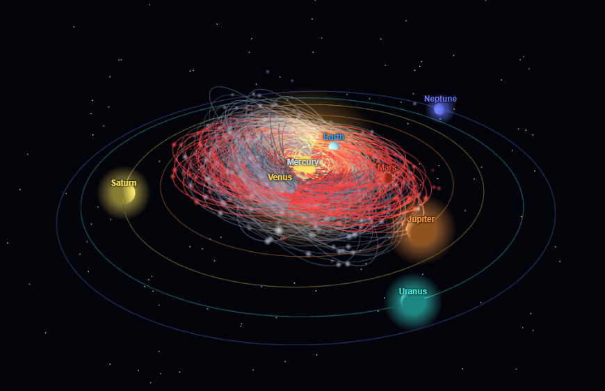

# NASA Close Approach Asteroids — Power BI Custom Visuals

Two animated solar-system Power BI custom visuals — **2D** and **3D** — built from
[NASA CNEOS close-approach data](https://cneos.jpl.nasa.gov/ca/). Planets orbit the Sun
on real Keplerian elements, and near-Earth asteroids appear when first observed, brighten
toward each close approach, and fade out at last observation — all driven by a scrubbable
1930–2026 timeline.



## The two visuals

| | 2D (`asteroid-orbital-visual`) | 3D (`asteroid-orbital-3d`) |
|---|---|---|
| Engine | D3.js (SVG) | Three.js (WebGL) |
| Orbits | Top-down, log radial scale | True 3D using `inclination` + `ascending_node_longitude` |
| Camera | Zoom / pan (scroll, drag, dbl-click reset) | Orbit / zoom (drag, scroll, dbl-click reset) |
| Packaged file | `release/asteroid-orbital-map-1.0.0.pbiviz` | `release/asteroid-orbital-map-3d-1.0.0.pbiviz` |

## Shared features

- **All 8 planets** as bright, distinct, glowing bodies on real orbits, with name labels
- **Observation lifecycle** — each asteroid appears at `first_observation_date`, its orbit
  line ramps up to the close approach and winds down, then everything disappears at
  `last_observation_date`
- **Close-approach emphasis** — 2D brightens/enlarges; 3D blinks fast at the approach point
- **Playback bar** — ⏮ ⏪ ⏸ ⏩ ⏭ plus a timeline scrubber and live date readout, fixed to
  1930–2026, always starting from the beginning
- **Logarithmic radial scale** so inner planets (Mercury–Mars) stay readable alongside Neptune
- **Format pane**: Show All 8 Planets, Animation Speed, Orbit Line Density, Orbit Trail Days
  (2D), Hazardous Asteroids Only
- Hover tooltips with orbit class, diameter, closest approach date, miss distance, velocity

## Repository layout

```
nasa asteroids/
├── asteroids_data.csv          # Raw NASA CNEOS export (nested close_approach_data)
├── asteroids_flat.csv          # Flattened — one row per close approach (import this)
├── flatten_asteroids.py        # Parses the nested data into the flat CSV
├── setup_and_run.ipynb         # Automated setup notebook (fetches from GitHub, builds, launches)
├── powerquery_web_connection.m # Power Query M to load the flat CSV from GitHub with typed columns
├── make_icon.py / make_icon_3d.py
├── asteroid-orbital-visual/    # 2D visual source (D3)
├── asteroid-orbital-3d/        # 3D visual source (Three.js)
├── release/                    # Prebuilt .pbiviz files — import these directly
└── reports/                    # Published Power BI report (.pbix, via Git LFS)
```

## Quick start

### Option A — import a prebuilt visual (no build)
1. Power BI Desktop → Visualizations pane → **`...` → Import a visual from a file**
2. Pick `release/asteroid-orbital-map-1.0.0.pbiviz` (2D) or `release/asteroid-orbital-map-3d-1.0.0.pbiviz` (3D)
3. Load the data via **Home → Get data → Web** and paste:
   `https://raw.githubusercontent.com/jdstigma/nasa-asteroids/main/asteroids_flat.csv`
   *(or paste `powerquery_web_connection.m` into the Advanced Editor for typed columns)*
4. Map the fields (below) and set numeric/date fields to **Don't summarize**

### Option B — build from source
```bash
# Install Node.js LTS, then:
npm install -g powerbi-visuals-tools
cd asteroid-orbital-visual    # or asteroid-orbital-3d
npm install
pbiviz package                # → dist/*.pbiviz
```

## Field mapping

Drag these into the visual's **Data Fields** bucket. Set every numeric and date field to
**Don't summarize**.

| Field | Used for |
|---|---|
| `name`, `short_name` | Asteroid identity |
| `potentially_hazardous` | Red / hazardous styling |
| `diameter_max_m` | Dot size |
| `semi_major_axis`, `eccentricity`, `perihelion_argument` | Orbit shape |
| `inclination`, `ascending_node_longitude` | 3D orbital tilt (**3D visual only**) |
| `first_observation_date`, `last_observation_date` | Appearance/disappearance lifecycle |
| `close_approach_date` | Timeline trigger |
| `miss_distance_au`, `velocity_km_s`, `orbiting_body`, `magnitude`, `orbit_class_type` | Tooltips |

## Data source

NASA Near Earth Object Web Service (NeoWs) / CNEOS. The raw `close_approach_data` column is
a nested Python-dict string; `flatten_asteroids.py` expands it into one row per close-approach
event. The `.pbix` report under `reports/` is stored via **Git LFS**.

## License

GNU General Public License v3.0 — see [LICENSE](LICENSE)
